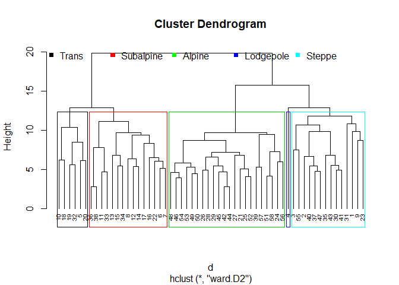
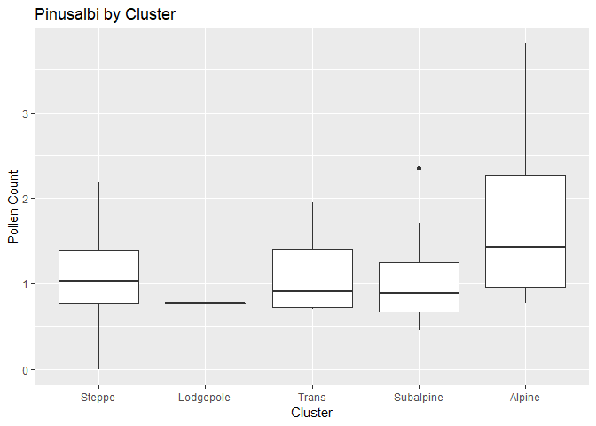
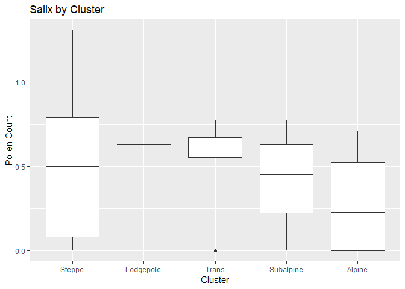
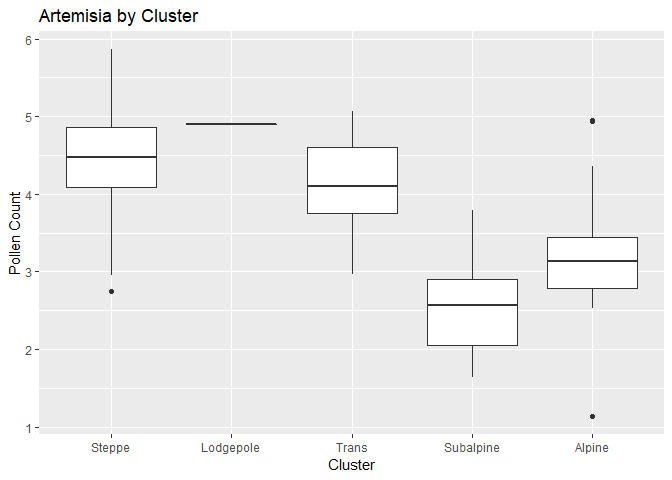

Pollen Clustering and ANOVAs
================
Andrea J. Elhajj
6/9/2019

## Introduction

This data set contains pollen data collected from 58 surface sites in
Yellowstone National Park. The pollen abundance of various vegetative
species at each site are stored in columns 4 through 35; values have
been square-root transformed to achieve normality. Column 3 contains a
factor (1 - 5) which corresponds to one of five vegetation zones that
were subjectively assigned by a researcher at University of Vermont:
(“Steppe”, “Lodgepole”, “Trans”, “Subalpine”, “Alpine”).

## Part 1: K-Means and Hierarchical Clustering

We are interested in running two clustering methods to assign individual
observations to natural groupings, and then compare these natural
groupings to the researcher’s expert-assigned classes.

``` r
library(dplyr)
```

    ## 
    ## Attaching package: 'dplyr'

    ## The following objects are masked from 'package:stats':
    ## 
    ##     filter, lag

    ## The following objects are masked from 'package:base':
    ## 
    ##     intersect, setdiff, setequal, union

``` r
library(ggplot2)
```

    ## Registered S3 methods overwritten by 'ggplot2':
    ##   method         from 
    ##   [.quosures     rlang
    ##   c.quosures     rlang
    ##   print.quosures rlang

``` r
library(readr)
```

First, we must scale the pollen data and calculate the dissimilarities
(Euclidean distances) between the pollen abundances:

``` r
df <- read_csv("yellpolsqrt.csv")
```

    ## Parsed with column specification:
    ## cols(
    ##   .default = col_double()
    ## )

    ## See spec(...) for full column specifications.

``` r
head(df)
```

    ## # A tibble: 6 x 35
    ##   Sample Elevation   Veg Pinusalbi Pinuscont Pinus Picea Abies Pseudotsug
    ##    <dbl>     <dbl> <dbl>     <dbl>     <dbl> <dbl> <dbl> <dbl>      <dbl>
    ## 1      1      1976     1      0.55      3.24  6.59  2.72  0.77       1.84
    ## 2      2      2042     1      1         3.74  7.36  1.79  1.38       0.78
    ## 3      3      2089     1      1.1       3.67  8.47  1.35  1.27       1.27
    ## 4      4      2060     1      0.77      2.72  5.57  0.63  1.18       0.89
    ## 5      5      2265     1      1.95      4.17  7.18  2.17  1.7        0.95
    ## 6      6      2070     2      0.45      4.99  8.67  1.1   1          0.45
    ## # ... with 26 more variables: Juniperus <dbl>, Ericaceae <dbl>,
    ## #   Alnus <dbl>, Betula <dbl>, Salix <dbl>, Populusba <dbl>,
    ## #   Populustr <dbl>, Acer <dbl>, TotalRosa <dbl>, Ceanothus <dbl>,
    ## #   Sarcobatus <dbl>, Poaceae <dbl>, Artemisia <dbl>, Ambrosia <dbl>,
    ## #   Tubuliflor <dbl>, Liguliflor <dbl>, Chenopodii <dbl>,
    ## #   Ranunculac <dbl>, Umbellifer <dbl>, Cruciferae <dbl>,
    ## #   Caryophyll <dbl>, Polygonum <dbl>, Eriogonum <dbl>, Rumex <dbl>,
    ## #   Leguminosa <dbl>, Selaginell <dbl>

``` r
Pollen_df <- as.data.frame(df[, 4:35]) # Extract columns containing pollen data
Pollen_df_sc <- scale(Pollen_df) # Scale the data
head(Pollen_df_sc)
```

    ##       Pinusalbi  Pinuscont      Pinus      Picea      Abies Pseudotsug
    ## [1,] -0.9929937 -0.5534262 -2.0370917  1.2192809 -1.2321851  2.5283476
    ## [2,] -0.3722240 -0.1730195 -1.0035026 -0.1647261 -0.1245960  0.4585366
    ## [3,] -0.2342752 -0.2262764  0.4864766 -0.8195251 -0.3243251  1.4153360
    ## [4,] -0.6895063 -0.9490491 -3.4062617 -1.8910143 -0.4877399  0.6733283
    ## [5,]  0.9382898  0.1541303 -1.2451208  0.4007821  0.4564344  0.7904874
    ## [6,] -1.1309425  0.7779973  0.7549413 -1.1915699 -0.8145695 -0.1858386
    ##        Juniperus  Ericaceae      Alnus     Betula      Salix  Populusba
    ## [1,]  1.76485963 -0.5336874  0.2329955  1.4303578  1.6853113 -0.3117643
    ## [2,]  1.17549536 -0.5336874 -1.1307765 -0.6286861  0.4687829 -0.3117643
    ## [3,] -0.03002247 -0.5336874 -0.3373091 -0.6286861 -0.2307209  0.6756667
    ## [4,]  0.55934180 -0.5336874 -1.1307765 -0.6286861  0.7120886 -0.3117643
    ## [5,]  1.41659893 -0.5336874  0.7785044 -0.6286861  0.4687829 -0.3117643
    ## [6,]  0.58613108 -0.5336874  0.2329955  0.5693031  0.1646508  1.3853828
    ##        Populustr       Acer  TotalRosa  Ceanothus Sarcobatus    Poaceae
    ## [1,]  0.70697659 -0.2619256 -1.2421619 -0.3343649  0.1772562  2.1156026
    ## [2,]  0.70697659 -0.2619256 -1.2421619 -0.3343649  3.0721296 -0.2252498
    ## [3,] -0.01350223 -0.2619256  0.4411416 -0.3343649  0.1772562 -0.5890309
    ## [4,]  0.39372493 -0.2619256  1.1144630 -0.3343649  0.7724638  1.9258038
    ## [5,]  1.39613023 -0.2619256 -1.2421619 -0.3343649  0.1772562  0.9609930
    ## [6,] -0.01350223 -0.2619256  0.4411416  2.0803480  0.3936953 -0.4308652
    ##       Artemisia   Ambrosia Tubuliflor Liguliflor Chenopodii Ranunculac
    ## [1,]  0.1391917  1.6188917  3.0796194  1.7668957  1.0534595   2.935310
    ## [2,]  1.3032229 -0.2489863  0.2195876 -0.4195704  0.5267297   1.609485
    ## [3,] -0.4709859  0.3922255  1.1580355  1.9656654 -0.2759060   1.609485
    ## [4,]  1.3595470  0.6988921  0.2195876  2.1076437  1.3042831   1.940941
    ## [5,]  1.5191319 -0.2489863 -2.0148123 -0.4195704  1.4547773  -0.740841
    ## [6,] -0.1236540 -0.0259561 -0.1379164 -0.4195704 -0.1504942   0.916440
    ##      Umbellifer Cruciferae Caryophyll  Polygonum  Eriogonum      Rumex
    ## [1,]  2.3865625  1.5014335 -0.8835472 -0.6708664 -0.2231301 -0.5038126
    ## [2,]  1.0977298  1.5014335 -0.8835472 -0.6708664 -0.2231301 -0.5038126
    ## [3,]  0.3566511  0.5728696  0.9884432 -0.6708664  3.6452664  0.8632578
    ## [4,]  1.3554964  1.8244122  3.5624301 -0.6708664 -0.2231301 -0.5038126
    ## [5,] -0.6744150 -0.7190453  0.7251946 -0.6708664 -0.2231301  1.8458396
    ## [6,]  0.3566511  0.5728696 -0.8835472 -0.6708664 -0.2231301 -0.5038126
    ##      Leguminosa Selaginell
    ## [1,] -0.2906269  0.4820345
    ## [2,] -0.2906269  1.2539284
    ## [3,] -0.2906269  1.4854966
    ## [4,]  4.9150139  5.1442739
    ## [5,] -0.2906269 -0.7066822
    ## [6,] -0.2906269 -0.2126701

``` r
d <- dist(Pollen_df_sc, method = "euclidean")
```

Next, we will use these distances to run a hierarchical clustering
analysis on these values. We will label the dendrogram with the
expert-assigned vegetation
zones:

``` r
hc <- hclust(d, method = "ward.D2") # Hierarchical clustering using Ward's method
plot(hc, cex = 0.6, hang = -1) # Plot the obtained dendrogram
rect.hclust(hc, k = 5, border = 1:5) # Create boxes around clusters in dendrogram
legend(-2,21, 
       #legend = c("1", "2", "3", "4", "5"),
       legend = c("Trans","Subalpine","Alpine","Lodgepole","Steppe"),
       col = c("black","red","green","blue","cyan"),
       pch = c(15), 
       bty = "n", 
       text.col = "black",
       bg = "transparent",
       horiz = T , 
       inset = c(0.1, 0.1))
```

<!-- -->

The hierarchichal clustering output above shows that 6 members have been
clustered into the Trans species cluster, 15 in the Subalpine species,
22 in Alpine, 1 in Lodgepole, and 14 in the Steppe.

Let’s add a column to the data that contains the cluster each member
belongs to:

``` r
sub_grp <- cutree(hc, k = 5) # Cut tree into 5 groups
df_final <- mutate(df, cluster = sub_grp)
head(df_final)
```

    ## # A tibble: 6 x 36
    ##   Sample Elevation   Veg Pinusalbi Pinuscont Pinus Picea Abies Pseudotsug
    ##    <dbl>     <dbl> <dbl>     <dbl>     <dbl> <dbl> <dbl> <dbl>      <dbl>
    ## 1      1      1976     1      0.55      3.24  6.59  2.72  0.77       1.84
    ## 2      2      2042     1      1         3.74  7.36  1.79  1.38       0.78
    ## 3      3      2089     1      1.1       3.67  8.47  1.35  1.27       1.27
    ## 4      4      2060     1      0.77      2.72  5.57  0.63  1.18       0.89
    ## 5      5      2265     1      1.95      4.17  7.18  2.17  1.7        0.95
    ## 6      6      2070     2      0.45      4.99  8.67  1.1   1          0.45
    ## # ... with 27 more variables: Juniperus <dbl>, Ericaceae <dbl>,
    ## #   Alnus <dbl>, Betula <dbl>, Salix <dbl>, Populusba <dbl>,
    ## #   Populustr <dbl>, Acer <dbl>, TotalRosa <dbl>, Ceanothus <dbl>,
    ## #   Sarcobatus <dbl>, Poaceae <dbl>, Artemisia <dbl>, Ambrosia <dbl>,
    ## #   Tubuliflor <dbl>, Liguliflor <dbl>, Chenopodii <dbl>,
    ## #   Ranunculac <dbl>, Umbellifer <dbl>, Cruciferae <dbl>,
    ## #   Caryophyll <dbl>, Polygonum <dbl>, Eriogonum <dbl>, Rumex <dbl>,
    ## #   Leguminosa <dbl>, Selaginell <dbl>, cluster <int>

We will now compare this clustering result to the expert-assigned
classification w/a contingency table:

``` r
dat <- table(df_final$Veg,df_final$cluster)
names(dimnames(dat)) <- c("Classification", "Cluster")
dat
```

    ##               Cluster
    ## Classification  1  2  3  4  5
    ##              1  3  1  1  0  0
    ##              2  1  0  1 10  0
    ##              3  2  0  3  1  7
    ##              4  5  0  1  4  2
    ##              5  3  0  0  0 13

We would like to compare the output from this hierarchical clustering to
a k-means clustering.

The k-means method is an agglomerative clustering algorithm, not a
recursively dividing one. Thus because there is no clustering hierarchy,
there is no dendrogram visualization.

``` r
kc <- kmeans(Pollen_df_sc, centers = 5, nstart = 25)
sub_grp2 <- kc$cluster
```

Add the cluster each observation belongs in to our original data:

``` r
df_final2 <- mutate(df, cluster = sub_grp2)
head(df_final2)
```

    ## # A tibble: 6 x 36
    ##   Sample Elevation   Veg Pinusalbi Pinuscont Pinus Picea Abies Pseudotsug
    ##    <dbl>     <dbl> <dbl>     <dbl>     <dbl> <dbl> <dbl> <dbl>      <dbl>
    ## 1      1      1976     1      0.55      3.24  6.59  2.72  0.77       1.84
    ## 2      2      2042     1      1         3.74  7.36  1.79  1.38       0.78
    ## 3      3      2089     1      1.1       3.67  8.47  1.35  1.27       1.27
    ## 4      4      2060     1      0.77      2.72  5.57  0.63  1.18       0.89
    ## 5      5      2265     1      1.95      4.17  7.18  2.17  1.7        0.95
    ## 6      6      2070     2      0.45      4.99  8.67  1.1   1          0.45
    ## # ... with 27 more variables: Juniperus <dbl>, Ericaceae <dbl>,
    ## #   Alnus <dbl>, Betula <dbl>, Salix <dbl>, Populusba <dbl>,
    ## #   Populustr <dbl>, Acer <dbl>, TotalRosa <dbl>, Ceanothus <dbl>,
    ## #   Sarcobatus <dbl>, Poaceae <dbl>, Artemisia <dbl>, Ambrosia <dbl>,
    ## #   Tubuliflor <dbl>, Liguliflor <dbl>, Chenopodii <dbl>,
    ## #   Ranunculac <dbl>, Umbellifer <dbl>, Cruciferae <dbl>,
    ## #   Caryophyll <dbl>, Polygonum <dbl>, Eriogonum <dbl>, Rumex <dbl>,
    ## #   Leguminosa <dbl>, Selaginell <dbl>, cluster <int>

Create a contingency table:

``` r
dat2 <- table(df_final2$Veg,df_final2$cluster)
names(dimnames(dat2)) <- c("Classification", "Cluster")
dat2
```

    ##               Cluster
    ## Classification  1  2  3  4  5
    ##              1  0  1  3  1  0
    ##              2  0  0  2  5  5
    ##              3  6  0  2  2  3
    ##              4  2  0  4  5  1
    ##              5 13  0  3  0  0

The output from each method shows that the hierarchal clustering
resulted in clusters that more closely matched the initial
classification conducted by the researcher than the k-means clustering
did. This is observable by following the diagonal of the data from the
top left corner to the bottom right corner (a total of 23 of the
observation matched in the hierarchal clustering, while only 5 matched
in the k-means clustering analysis).

The output from the two methods differs because of the methods
underlying hierarchal and k-means clustering. The objective function of
a k-means algorithm is to minimize within cluster sum of squares, while
a hierarchal clustering algorithm relies on distance to group together
observations that are more like one another. The application of a
hierarchal clustering algorithm is ideal for smaller sets of data, while
a k-means algorithm works best for large sets of data. This is a smaller
data set, containing 58 observations. Therefore, it is understandable
that the hierarchal clustering resulted in an output that is more in
line with the classification that the researcher conducted based on the
similarities he/she studied.

## Part 2: Boxplots and ANOVAs

Next, we are interested in examining the following three pollen types
more closely:

1.  Pinusalbi
2.  Salix
3.  Artemisia

For each of these three pollen types, we will generate box plots of
transformed values by cluster from the hierarchical clustering result
above.

To begin, we will extract the pollen type and cluster column from the
data frame:

``` r
Pinusalbi_df <- data.frame(df_final$Pinusalbi, df_final$cluster)
Salix_df <- data.frame(df_final$Salix, df_final$cluster)
Artemisia_df <- data.frame(df_final$Artemisia, df_final$cluster)
```

And now we will create box plots of transformed values by
cluster:

``` r
ggplot(Pinusalbi_df, aes(x = factor(df_final.cluster), y = df_final.Pinusalbi)) + 
  geom_boxplot() +
        labs(x = "Cluster", y = "Pollen Count", title = "Pinusalbi by Cluster") +
        scale_x_discrete(labels=c("1" = "Steppe", "2" = "Lodgepole", "3" = "Trans", "4" = "Subalpine", "5" = "Alpine"))
```

<!-- -->

``` r
ggplot(Salix_df, aes(x = factor(df_final.cluster), y = df_final.Salix)) + 
  geom_boxplot() +
        labs(x = "Cluster", y = "Pollen Count", title = "Salix by Cluster") +
        scale_x_discrete(labels=c("1" = "Steppe", "2" = "Lodgepole", "3" = "Trans", "4" = "Subalpine", "5" = "Alpine"))
```

<!-- -->

``` r
ggplot(Artemisia_df, aes(x = factor(df_final.cluster), y = df_final.Artemisia)) + 
  geom_boxplot() +
        labs(x = "Cluster", y = "Pollen Count", title = "Artemisia by Cluster") + 
        scale_x_discrete(labels=c("1" = "Steppe", "2" = "Lodgepole", "3" = "Trans", "4" = "Subalpine", "5" = "Alpine"))
```

<!-- -->

Are the means of each pollen type by cluster different from the overall
mean? While the box plots above help us answer this question, we will
run an Analysis of Variance (ANOVA) for each pollen type by cluster
assignment:

``` r
Pinusalbi_aov<- aov(df_final.Pinusalbi ~ as.factor(df_final.cluster), data = Pinusalbi_df)
Salix_aov <- aov(df_final.Salix ~ as.factor(df_final.cluster), data = Salix_df)
Artemisia_aov <- aov(df_final.Artemisia ~ as.factor(df_final.cluster), data = Artemisia_df)

summary(Pinusalbi_aov)
```

    ##                             Df Sum Sq Mean Sq F value Pr(>F)  
    ## as.factor(df_final.cluster)  4  5.411  1.3527   2.921 0.0295 *
    ## Residuals                   53 24.542  0.4631                 
    ## ---
    ## Signif. codes:  0 '***' 0.001 '**' 0.01 '*' 0.05 '.' 0.1 ' ' 1

``` r
summary(Salix_aov)
```

    ##                             Df Sum Sq Mean Sq F value Pr(>F)
    ## as.factor(df_final.cluster)  4  0.667  0.1666   1.607  0.186
    ## Residuals                   53  5.496  0.1037

``` r
summary(Artemisia_aov)
```

    ##                             Df Sum Sq Mean Sq F value   Pr(>F)    
    ## as.factor(df_final.cluster)  4  31.89   7.972   12.88 2.14e-07 ***
    ## Residuals                   53  32.80   0.619                     
    ## ---
    ## Signif. codes:  0 '***' 0.001 '**' 0.01 '*' 0.05 '.' 0.1 ' ' 1

For Pinusalbi, the evidence suggests that at the there is a significant
relationship between the pollen count and cluster assignment (F = 2.92,
p = 0.03). For Salix, there is not enough evidence to suggest that such
a relationship exists (F = 1.61, p = 0.19). Lastly, the ANOVA results
for Artemisia, the evidence suggests that there is indeed a significant
relationship between pollen count and cluster (F = 12.88, p =
2.14e-0.7). All of these tests were conducted at the 95% level of
confidence.

However, the ANOVA tests do not tell us which groups are different from
the others. For this, we will use the Tukey post-hoc test:

``` r
TukeyHSD(Pinusalbi_aov)
```

    ##   Tukey multiple comparisons of means
    ##     95% family-wise confidence level
    ## 
    ## Fit: aov(formula = df_final.Pinusalbi ~ as.factor(df_final.cluster), data = Pinusalbi_df)
    ## 
    ## $`as.factor(df_final.cluster)`
    ##            diff          lwr       upr     p adj
    ## 2-1 -0.26785714 -2.256928315 1.7212140 0.9954251
    ## 3-1  0.07714286 -0.860514286 1.0148000 0.9993333
    ## 4-1 -0.02319048 -0.737288881 0.6909079 0.9999834
    ## 5-1  0.61850649 -0.038462093 1.2754751 0.0741798
    ## 3-2  0.34500000 -1.730592565 2.4205926 0.9897700
    ## 4-2  0.24466667 -1.739979425 2.2293128 0.9967493
    ## 5-2  0.88636364 -1.078449663 2.8511769 0.7080928
    ## 4-3 -0.10033333 -1.028566547 0.8278999 0.9980519
    ## 5-3  0.54136364 -0.343672007 1.4263993 0.4264449
    ## 5-4  0.64169697 -0.001749768 1.2851437 0.0509491

``` r
TukeyHSD(Salix_aov)
```

    ##   Tukey multiple comparisons of means
    ##     95% family-wise confidence level
    ## 
    ## Fit: aov(formula = df_final.Salix ~ as.factor(df_final.cluster), data = Salix_df)
    ## 
    ## $`as.factor(df_final.cluster)`
    ##            diff        lwr        upr     p adj
    ## 2-1  0.13571429 -0.8055429 1.07697148 0.9940502
    ## 3-1  0.02738095 -0.4163319 0.47109385 0.9997865
    ## 4-1 -0.06695238 -0.4048741 0.27096929 0.9802627
    ## 5-1 -0.22746753 -0.5383546 0.08341949 0.2499293
    ## 3-2 -0.10833333 -1.0905337 0.87386703 0.9978920
    ## 4-2 -0.20266667 -1.1418298 0.73649651 0.9729998
    ## 5-2 -0.36318182 -1.2929598 0.56659620 0.8041670
    ## 4-3 -0.09433333 -0.5335867 0.34492002 0.9734692
    ## 5-3 -0.25484848 -0.6736601 0.16396316 0.4317719
    ## 5-4 -0.16051515 -0.4650034 0.14397313 0.5742542

``` r
TukeyHSD(Artemisia_aov)
```

    ##   Tukey multiple comparisons of means
    ##     95% family-wise confidence level
    ## 
    ## Fit: aov(formula = df_final.Artemisia ~ as.factor(df_final.cluster), data = Artemisia_df)
    ## 
    ## $`as.factor(df_final.cluster)`
    ##           diff         lwr         upr     p adj
    ## 2-1  0.4721429 -1.82716602  2.77145173 0.9774838
    ## 3-1 -0.3195238 -1.40342841  0.76438079 0.9193215
    ## 4-1 -1.8918571 -2.71733429 -1.06637999 0.0000003
    ## 5-1 -1.2178571 -1.97729387 -0.45842042 0.0003182
    ## 3-2 -0.7916667 -3.19099178  1.60765844 0.8832672
    ## 4-2 -2.3640000 -4.65819361 -0.06980639 0.0403876
    ## 5-2 -1.6900000 -3.96126747  0.58126747 0.2348269
    ## 4-3 -1.5723333 -2.64534414 -0.49932252 0.0011477
    ## 5-3 -0.8983333 -1.92140900  0.12474233 0.1108084
    ## 5-4  0.6740000 -0.06980586  1.41780586 0.0930792

For Pinusalbi, this test shows that there is a significant difference in
pollen means between cluster groups Subalpine and Alpine (p = 0.05).

For Artemisia, there is a significant difference in pollen means between
cluster groups Subalpine and Steppe (p \< 0.0005), groups Alpine and
Steppe (p \< 0.0005), groups Subalpine and Lodgepole (p = 0.04), groups
Subalpine and Trans (p = 0.001).
